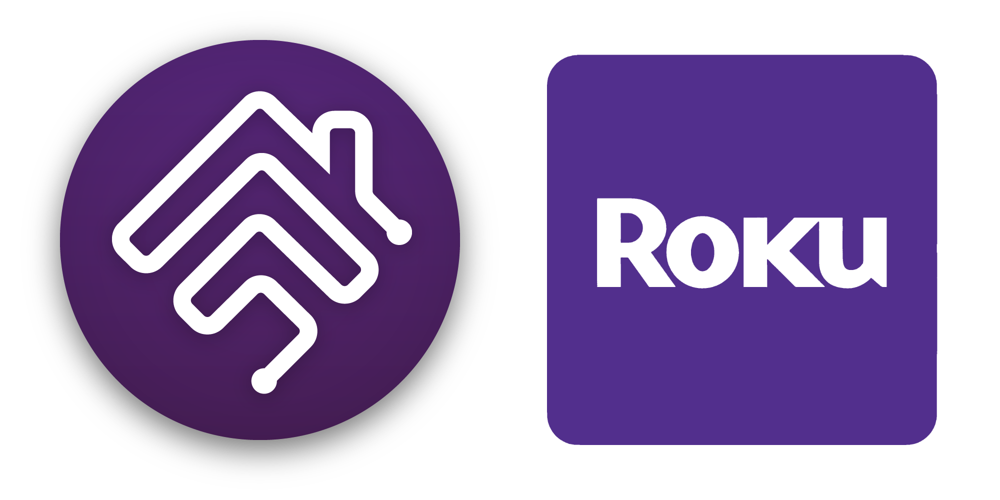

<SPAN ALIGN="CENTER" STYLE="text-align:center">
<DIV ALIGN="CENTER" STYLE="text-align:center">

[](https://github.com/traviswparker/homebridge-roku-tv)

# Homebridge Roku TV
[](https://www.npmjs.com/package/homebridge-roku-tv)
[](https://www.npmjs.com/package/homebridge-roku-tv)

# Complete HomeKit support for the Roku ecosystem using [Homebridge](https://homebridge.io).
</DIV>
</SPAN>

`homebridge-roku-tv` is a plugin for Homebridge that allows you to control your Roku devices and apps.

## Why use this plugin?

- The ability to manually add devices to HomeKit rather than relying on auto-discovery.
- Optional automatic discovery of Roku devices on your network.
- Device blocklist to prevent devices you don't want to appear in HomeKit from being discovered.

Like the other apps, we still also have an app blocklist and the ability to set the polling interval.

## Installation

1. Install Homebridge using the official guide [here](https://homebridge.io/install/).

2. Install `homebridge-roku-tv` plugin using npm:
    ```
    sudo npm install -g homebridge-roku-tv
    ```

3. Run Homebridge with the Roku platform:
    ```
    homebridge -I
    ```

## Configuration

To configure the Roku platform, you will need to add the following to your `config.json` file:

```json
{
    "platforms": [
        {
            "platform": "Roku",
            "name": "Roku",
            "devices": [
                {
                    "name": "Roku TV",
                    "ip": "192.168.1.100"
                }
            ],
            "excludedApps": ["SomeAppToExclude"],
            "pollingInterval": 30000,
            "autoDiscover": true
        }
    ]
}
```
